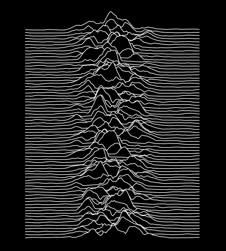
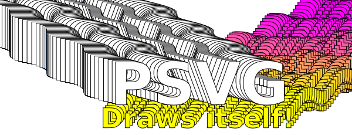

# Gallery
PSVG `examples/` showcase! You can also fiddle with these examples on the online [Playground](https://psvg.netlify.app/). 


## [hilbert.psvg](hilbert.psvg) → [hilbert.svg](hilbert.svg)


```xml
<!-- hilbert.psvg -->
<!-- draws a hiblert curve -->
<!-- based on https://en.wikipedia.org/wiki/Hilbert_curve
          and http://www.rosettacode.org/wiki/Hilbert_curve#Java -->
```


## [koch.psvg](koch.psvg) → [koch.svg](koch.svg)


```xml
<!-- koch.psvg -->
<!-- draws a koch snowflake -->
```


## [poisson.psvg](poisson.psvg) → [poisson.svg](poisson.svg)


```xml
<!-- poisson.psvg -->
<!-- poisson disk sampling -->
<!-- based on paper https://www.cs.ubc.ca/~rbridson/docs/bridson-siggraph07-poissondisk.pdf -->
<!-- and this impl. https://editor.p5js.org/codingtrain/sketches/4N78DFCXN -->
```


## [pulsar.psvg](pulsar.psvg) → [pulsar.svg](pulsar.svg)



```xml
<!-- pulsar.psvg -->
<!-- recreation of the pulsar radio emission plot -->
<!-- from the "Unknown Pleasures" album cover -->
<!-- (includes a perlin noise implementation) -->
<!-- adapted from https://github.com/processing/p5.js/blob/1.1.9/src/math/noise.js -->
<!-- <var scaled_cosine="{(i)=>(0.5*(1.0-COS(i*PI)))}"/> -->
```


## [pythagoras.psvg](pythagoras.psvg) → [pythagoras.svg](pythagoras.svg)


```xml
<!-- pythagoras.psvg -->
<!-- draws a pythagoras fractal tree -->
<!-- inspired by https://en.wikipedia.org/wiki/Pythagoras_tree_(fractal)#/media/File:Pythagoras_Tree_Colored.png -->
```


## [schotter.psvg](schotter.psvg) → [schotter.svg](schotter.svg)



```xml
<!-- schotter.psvg -->
<!-- recreation of the Georg Nees classic -->
<!-- with silly animations -->
```


## [shapemorph.psvg](shapemorph.psvg) → [shapemorph.svg](shapemorph.svg)


```xml
<!-- shapemorph.psvg -->
<!-- animation of simple shapes morphing between each other -->
```


## [sierpinski.psvg](sierpinski.psvg) → [sierpinski.svg](sierpinski.svg)


```xml
<!-- sierpinski.psvg -->
<!-- draws a Sierpinski's triangle -->
```


## [sphere.psvg](sphere.psvg) → [sphere.svg](sphere.svg)


```xml
<!-- sphere.psvg -->
<!-- 3D animated shaded sphere -->
```


## [terrain.psvg](terrain.psvg) → [terrain.svg](terrain.svg)


```xml
<!-- terrain.psvg -->
<!-- animated wireframe terrain in 3D -->
<!-- alternatively, use perlin noise from example/pulsar.psvg -->
```


## [textanim.psvg](textanim.psvg) → [textanim.svg](textanim.svg)



```xml
<!-- text-anim.psvg -->
<!-- draws animated text -->
<!-- try begin="{-i/100}s" to make animation start from the beginning -->
```


## [tree.psvg](tree.psvg) → [tree.svg](tree.svg)


```xml
<!-- tree.psvg -->
<!-- A port of https://processing.org/examples/tree.html -->
```

